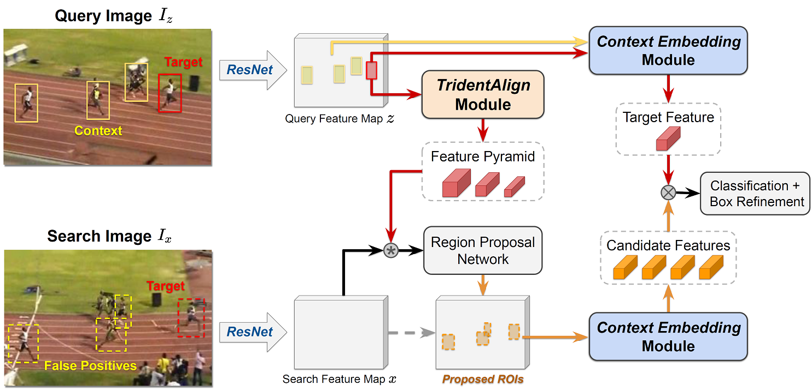
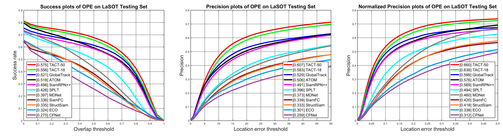

# Visual Tracking by TridentAlign and Context Embedding (TACT)

Test code for "Visual Tracking by TridentAlign and Context Embedding" 

#### Janghoon Choi, Junseok Kwon, and Kyoung Mu Lee


## Overall Framework




## Results on LaSOT test set



- Link to [LaSOT dataset](https://cis.temple.edu/lasot/)
- Raw results available on [Google drive](https://drive.google.com/drive/folders/1ShAPX-ho-b_JjEenPCjzy1m4UN-ooSot?usp=sharing)


## Dependencies

- Ubuntu 18.04
- Python==2.7.17
- numpy==1.16.5
- pytorch==1.3.0
- matplotlib==2.2.4
- opencv==4.1.0.25
- moviepy==1.0.0
- tqdm==4.32.1


## Usage

### Prerequisites

- Download network weights from [Google drive](https://drive.google.com/drive/folders/1ShAPX-ho-b_JjEenPCjzy1m4UN-ooSot?usp=sharing)
- Copy network weight files `ckpt_res18.tar` and `ckpt_res50.tar` to `ckpt/` folder
- Choose between `TACT-18` and `TACT-50` by modifying the `cfgs/cfg_test.py` file (default: `TACT-50`)

### To test tracker on LaSOT test set

- Download LaSOT dataset from [link](https://cis.temple.edu/lasot/)
- Modify `cfgs/cfg_test.py` file to local `LaSOTBenchmark` folder path
- Run `python test_tracker.py`

### To test tracker on an arbitrary sequence

- Using `run_track_seq()` function in `tracker_batch.py`, tracker can run on an arbitrary sequence
- Provide the function with following variables
  - `seq_name` : name of the given sequence
  - `seq_path` : path to the given sequence
  - `seq_imlist` : list of image file names of the given sequence
  - `seq_gt` : ground truth box annotations of the given sequence (may only contain annotation for initial frame, `[x_min,y_min,width,height]` format)

### Raw results on other datasets

- Link to raw results on [Google drive](https://drive.google.com/drive/folders/1ShAPX-ho-b_JjEenPCjzy1m4UN-ooSot?usp=sharing)
  - Results for test sets of [LaSOT](https://cis.temple.edu/lasot/), [OxUvA](https://oxuva.github.io/long-term-tracking-benchmark/), [GOT-10k](http://got-10k.aitestunion.com/), [TrackingNet](https://tracking-net.org/)
  

## Citation

If you find our work useful for your research, please consider citing the following paper:

``` text
@article{choi2020tact,
  title={Visual tracking by tridentalign and context embedding},
  author={Choi, Janghoon and Kwon, Junseok and Lee, Kyoung Mu},
  journal={arXiv preprint arXiv:},
  year={2020}
}
```


